# Release Manager Web 控制台 · 使用手册

本手册面向**使用控制台的人**（平台管理员 / 发布管理员 / 只读观察者），回答「每个页面是干什么的、
怎么点、点完会发生什么、出错先看哪里」。系统边界与契约见 `docs/architecture.md`，
环境如何起与清见 `docs/dev-environment.md`，值班处置见 `docs/runbook.md` —— 本文不重复这些内容。

## 0. 手册的证据与适用边界

| 项 | 值 |
| --- | --- |
| 截图环境 | 本机 dev 环境：`make dev-up` 起的 5 个 k3d 集群（1 控制面 + 4 客户集群）+ `release-manager-registry` + 管理面服务 8082–8088 |
| 夹具数据 | canonical fixture `v2`（2 Customer / 4 Cluster / 8 路由 / 4 Operator / 4 ReleaseDefinition / 1 Bundle），**另经** `test/e2e/prerequisite/smoke.sh` 跑出真实 Operation（UPGRADE / CANCELLED / ROLLBACK） |
| 截图入口 | 已部署的控制台 `http://127.0.0.1:8087`（`release-web`，nginx 反代），视口 1440×900，整页截图 |
| 截图日期 | 2026-09-28（共 22 张，全部本日实测；其中 `21-login-unpatched-no-progress.png` 取自**回滚后的交付版本**，其余取自出图补丁环境） |
| 账号 | `dev-admin`（platform_admin），口令在 `data/dev-credentials.env`（**不入库、不入文档**） |

> ⚠️ **重要前提：本手册的截图是在一个临时补丁下取得的。**
> 该版本的 Web 控制台**无法通过自身登录流程进入**，因此无法直接截到任何已登录页面。
> 为了给出手册所需的真实界面，本次在**独立 worktree**（`.worktrees/ux-manual`）上打了一个
> dual-mode 认证补丁（`cmd/auth/main.go:194` 传入 `BrowserSessionConfig`，并在浏览器分支下
> 同时返回 bearer token），只重建 `release-auth` 镜像、只作用于本次 dev 环境；
> 主工作树**零改动**。补丁与验证记录见第 15 节与 `docs/ux-review.md`。
> 未打补丁时的真实表现为：登录接口返回 200 但 `user` 为空且不下发 cookie，前端被守卫弹回
> `/login`；这是本次审查的头号 blocker。

## 1. 术语与页面地图

| 术语 | 含义 |
| --- | --- |
| **Customer** | 租户边界，拥有自己的 Cluster、ReleaseDefinition、Operator 与 Release 数据 |
| **Cluster** | 归属单个 Customer 的目标 Kubernetes 集群，是 Release 部署与 Operator 运行的隔离边界 |
| **ReleaseDefinition** | 描述目标 Customer/Cluster、namespace、release name 与 chart 的持久发布目标配置 |
| **Release** | Operator 从目标集群同步回来的 Helm Release 实况（含 revision、values digest、最近同步时间） |
| **ValuesRevision** | 不可变的配置版本；发布操作绑定一个**已审批**的 ValuesRevision |
| **Operation** | 一次发布动作（INSTALL / UPGRADE / ROLLBACK），有状态机、Preflight 与时间线 |
| **Preflight** | 发布前的有序准入检查（artifact → render → cluster dry-run → runtime image pull 等） |

页面与路由：

| 页面 | 路由 | 一句话 |
| --- | --- | --- |
| 登录 | `/login` | 建立服务端会话 |
| 首屏 | `/` | 当前组织与身份；无发布活动时是空态 |
| 客户列表 | `/customers` | 租户总览 |
| 客户详情 | `/customers/:id` | 编辑客户、禁用客户、变更历史 |
| 集群列表 | `/customers/:customerId/clusters` | 该客户的发布目标清单 |
| 集群详情 | `/customers/:customerId/clusters/:clusterId` | 摘要 + 镜像/Chart 路由只读视图 |
| 集群编辑 | `/customers/:customerId/clusters/:clusterId/edit` | 名称、是否作为发布目标、路由规则 |
| Operator 列表 | `/customers/:customerId/clusters/:clusterId/operators` | 注册历史与在线状态 |
| Operator 详情 | `.../operators/:operatorId` | 身份、会话、能力、撤销 |
| Release 清单 | `.../releases` | Operator 同步回来的 Release |
| Values 编辑器 | `.../releases/:releaseId/values` | 编辑 canonical values、SecretRef、审批 |
| 创建操作 | `.../operations/new` | 选制品与已审批配置，确认后启动 |
| 操作详情 | `.../operations/:operationId` | Preflight 结果、状态、时间线、取消 |
| 紧急变更 | `.../emergency` | 绕过常规流程的镜像/副本变更 |
| 收敛任务 | `.../emergency/convergence` | 紧急变更后的收敛补齐 |
| 审计 | `/audit` | 组织级审计事件查询与导出 |

## 2. 起环境、拿账号、收尾

```bash
make dev-up        # 起完整 dev 环境（幂等；含 install 阶段 seed）
make dev-seed      # 需要单独重跑夹具时
make dev-status    # 打印机器可读的 data/dev-status.json
```

- 宿主端口冲突时用 `REGISTRY_PORT` / `DEV_K3D_API_PORT` 覆盖（本手册使用 `REGISTRY_PORT=5011`、`DEV_K3D_API_PORT=6449`，因为默认的 5001/6443 被同机另一套环境占用）。
- 账号口令落在 `data/dev-credentials.env`（0600）：`dev-admin` / `dev-deployer` / `dev-reader` / `e2e-runner`。
- 控制台两种入口：**容器部署** `http://localhost:8087`（`release-web` + nginx 反代，本手册截图所用）；**开发服务器** `cd web && npm run dev` → `http://127.0.0.1:5173`（Vite 按包名前缀代理到 8082–8088）。
- 收尾：`make dev-down`（删 5 个集群、保留 registry），或 `make dev-purge CONFIRM=1`（连 registry 与 `data/` 运行时文件一起删）。两者都是**破坏性操作**，执行前确认没有需要保留的现场。

## 3. 登录与首屏

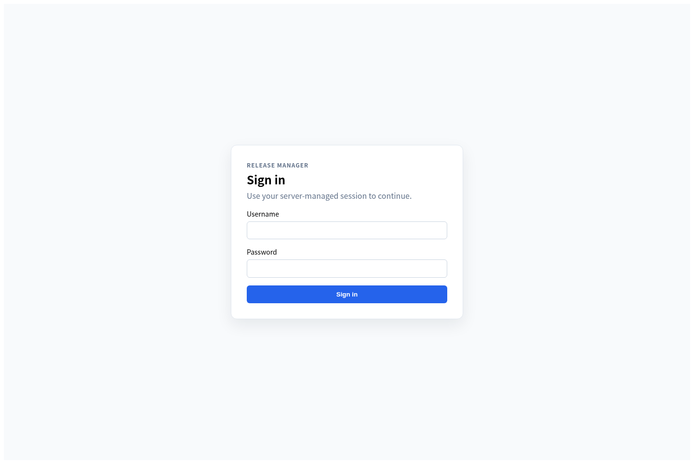

1. 打开 `/login`，填 `Username` 与 `Password`（表单用服务端管理的 HttpOnly 会话，前端不存 token）。
2. 点 `Sign in`。提交中按钮变 `Signing in…` 并禁用。
3. 成功后落到 `/`；若之前被守卫拦下过，会先回到原来的 `return URL`。

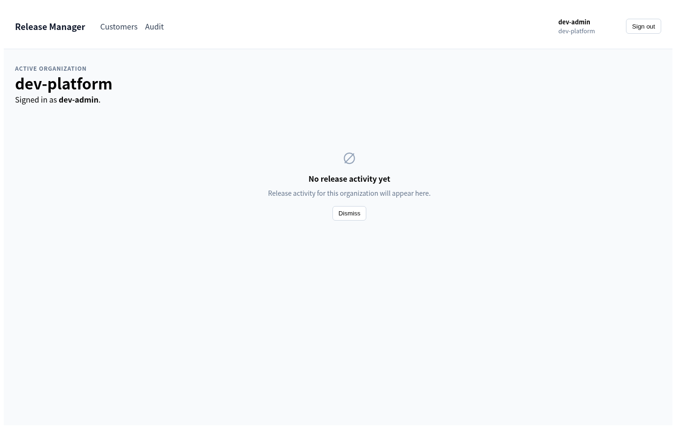

首屏只回答三件事：**当前是哪个组织**、**当前是谁**、**有没有发布活动**。
顶栏固定提供 `Customers` / `Audit`、身份区与 `Sign out`；组织切换器只在
**该账号可切换组织时**才渲染（`OrganizationSwitcher.vue:37` 的 `v-if="canSwitchOrganizations"`，
即 platform_admin 且可切换组织不止一个；本环境只有 1 个组织，所以截图里没有它）。进入某个客户后
顶栏会多出 `Clusters`。

> 会话过期或任一请求返回 `unauthenticated` 时会跳回 `/login?reason=expired`，登录页顶部显示
> `Your session expired. Sign in again to return to your previous page.`，登录后回到原页面。

## 4. Customer 管理

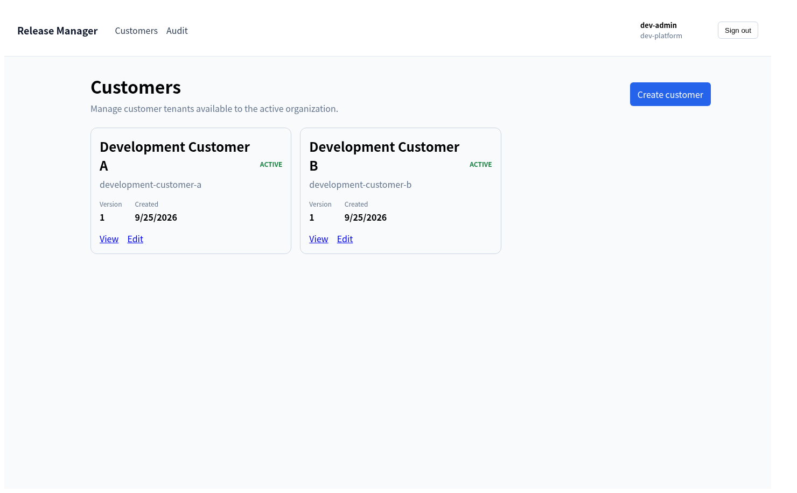

每张卡片是一个租户：名称、slug、`ACTIVE`/禁用状态、配置版本与创建时间，动作是 `View` / `Edit`。
`Create customer` 仅对有写权限的角色可见。

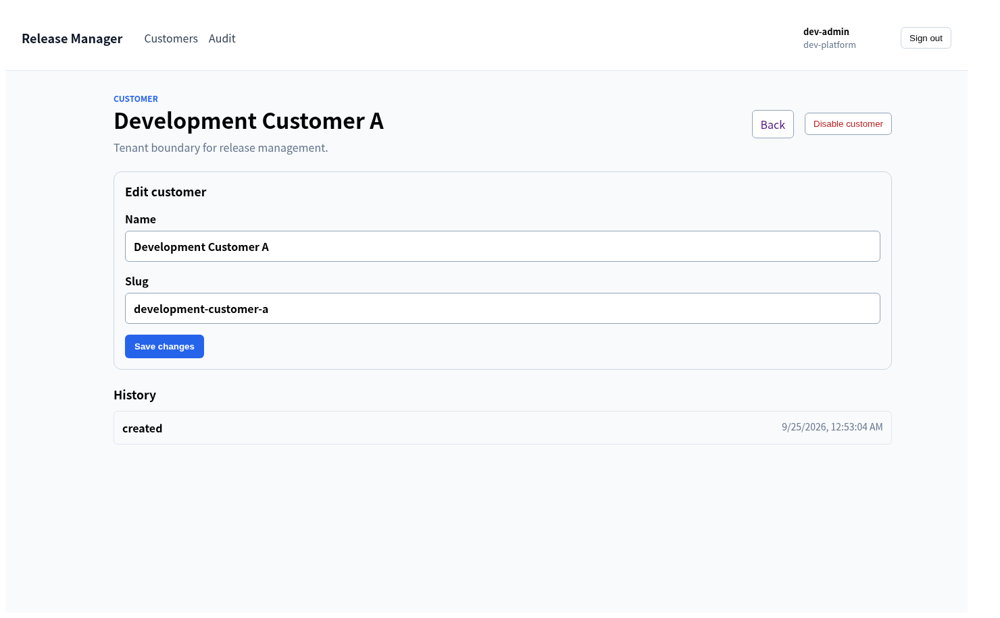

- 编辑 `Name` / `Slug` 后 `Save changes`（提交中变 `Saving…`）。
- `Disable customer` 是**级联破坏性操作**（吊销 token/证书/会话），需要勾选确认后执行。
- 下方 `History` 是该客户的变更事件流。

## 5. Cluster 管理

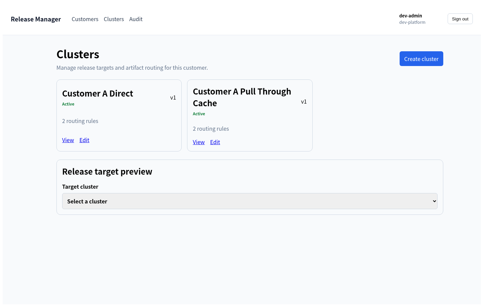

卡片显示集群名、`Active`/禁用、配置版本、路由规则条数。页面下半部是 `Release target preview`：
选一个集群即可预览它作为发布目标时的路由解析结果。

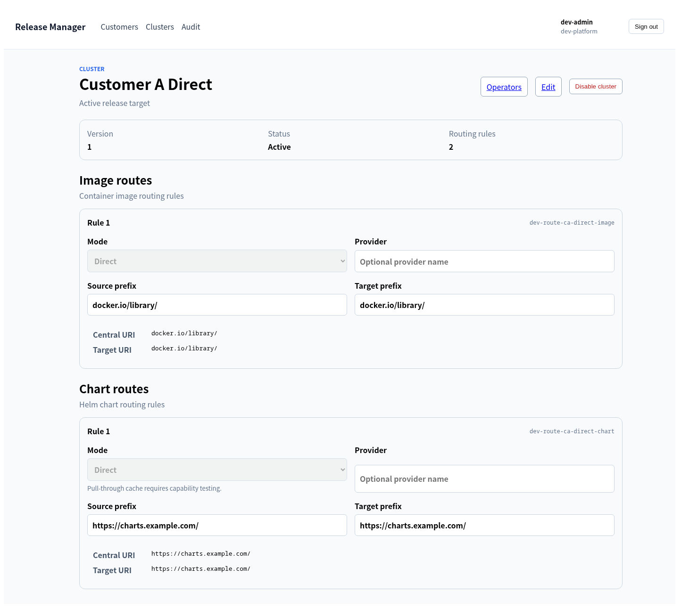

- 摘要三项：`Version` / `Status` / `Routing rules`。
- `Image routes` 与 `Chart routes` 是**只读**呈现（`Mode` / `Provider` / `Source prefix` / `Target prefix`，以及派生出的 `Central URI` / `Target URI`）。
- `Operators` 进入该集群的 Operator 页面；`Edit` 进入编辑页；`Disable cluster` 会弹原生确认框。

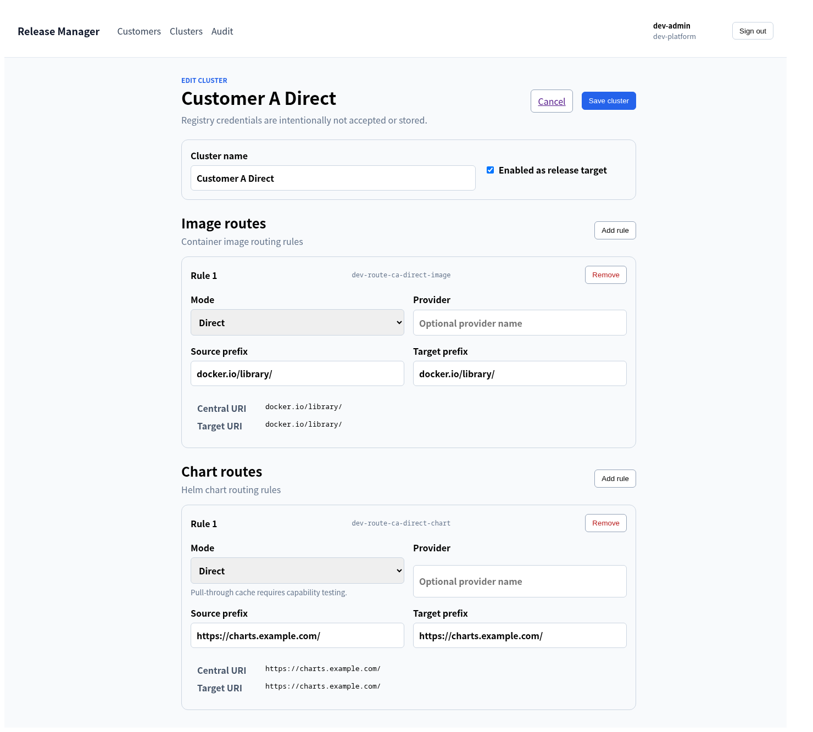

编辑页可改 `Cluster name`、勾选 `Enabled as release target`，并用 `Add rule` / `Remove` 维护路由规则
（`Mode` 的 `Direct` / `Pull-through cache` / `Replicated`，以及 provider 与前缀）。

## 6. Operator 管理

Operator 是跑在客户集群里的 agent，负责执行 Helm 操作并回传库存。

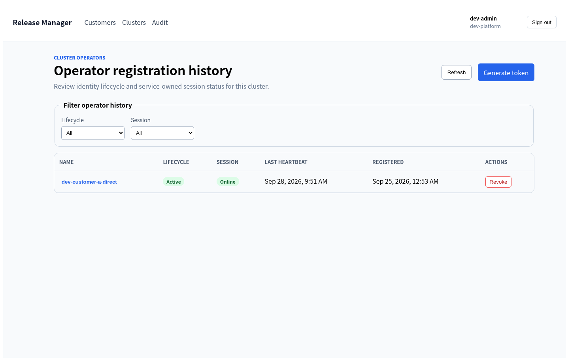

- 顶部动作：`Refresh`、`Generate token`。
- `Filter operator history` 可按 `Lifecycle`（All/Active/Superseded/Revoked）与 `Session`（All/No session/Online/Suspect/Offline/Revoked）过滤。
- 表格列：`NAME` / `LIFECYCLE` / `SESSION` / `LAST HEARTBEAT` / `REGISTERED` / `ACTIONS`；行内可进详情或 `Revoke`。

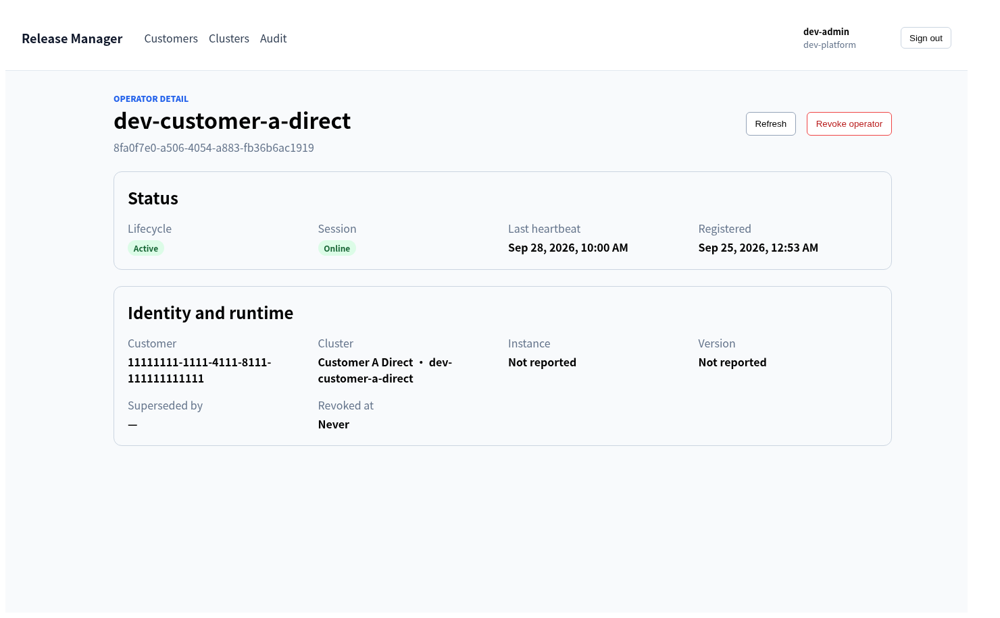

详情页有两块**总会渲染**的信息：`Status`（生命周期、会话、最后心跳、注册时间）与
`Identity and runtime`（Customer / Cluster / Instance / Version / Superseded by / Revoked at）。
第三块 `Capabilities` 是**条件渲染**的——仅当该 Operator 上报的能力集合非空时才出现
（`OperatorDetailPage.vue:100` 的 `v-if="Object.keys(...capabilities).length"`），
本环境的 Operator 未上报能力，所以截图里只有两块。
注册流程：`Generate token` 生成一次性注册令牌 → 按弹窗给出的 `Deployment command` 在客户集群部署 →
勾选「已保存到密钥库」后关闭（未勾选则关闭会吊销待用令牌）。

## 7. Release 清单

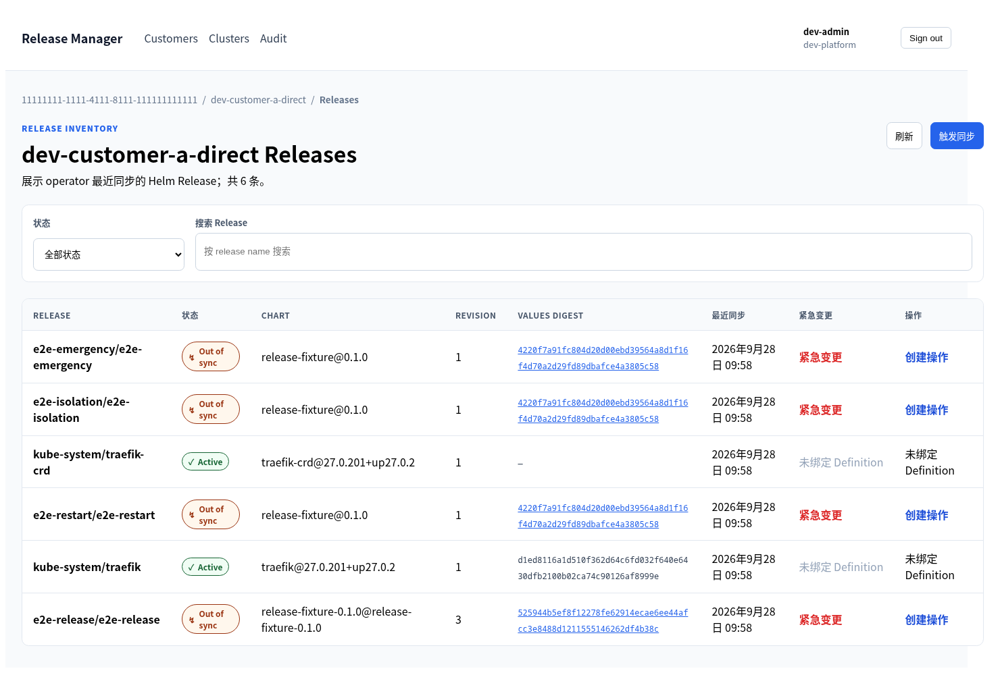

- 顶部两行说明数据来源（Operator 最近一次同步）与条数；动作 `刷新` / `触发同步`。
- 可按 `状态`（全部状态 / Active / Missing / Out of sync）与 release name 搜索过滤。
- 表格列：`RELEASE` / `状态` / `CHART` / `REVISION` / `VALUES DIGEST` / `最近同步` / `紧急变更` / `操作`。
- 绑定 Definition 的行才有 `紧急变更` 与 `创建操作`；未绑定的行这两列是灰色阻断态，并给出原因。

## 8. ValuesRevision 编辑与审批

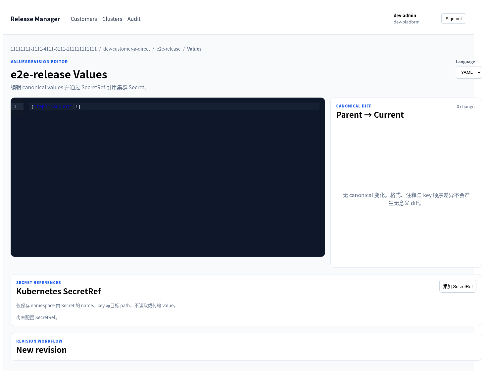

- 编辑器支持 `YAML` / `JSON` 两种语言视图，右侧是 `CANONICAL DIFF`（Parent → Current），只显示语义差异。
- `SECRET REFERENCES` 只保存 namespace 内 Secret 的 `name` / `key` / 目标 `path`，**不读取也不传输 value**。
- `保存 Draft` → `Submit` → 审批人 `Approve` / `Reject`。Draft 会存到浏览器本地，刷新后提示
  `已恢复未保存的编辑`；只读角色会看到 `当前角色为只读。服务端仍会独立执行授权。`

## 9. 发布操作（创建 → 确认 → Preflight → 详情）

### 9.1 创建

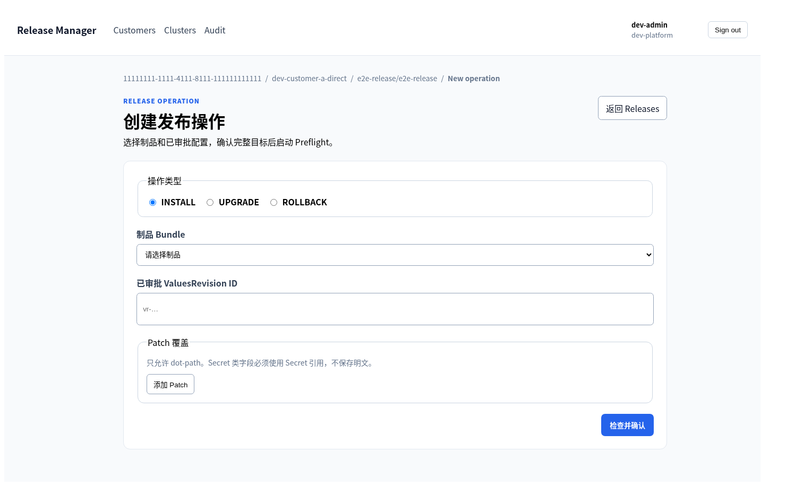

1. `操作类型` 选 `INSTALL` / `UPGRADE` / `ROLLBACK`。
2. `制品 Bundle` 下拉选制品（显示版本与 digest）。
3. `已审批 ValuesRevision ID` 填已审批的 Revision；`UPGRADE` / `ROLLBACK` 还会出现 `当前 Revision`（必填，≥1）。
4. 需要覆盖时用 `添加 Patch`（只允许 dot-path；Secret 类字段必须用 Secret 引用）。
5. 点 `检查并确认` 进入最终确认。

> 表单的必填项由浏览器原生校验兜底：漏填 `当前 Revision` 时点击不会提交，只有原生 tooltip 提示，
> 页面内没有字段级错误文案。

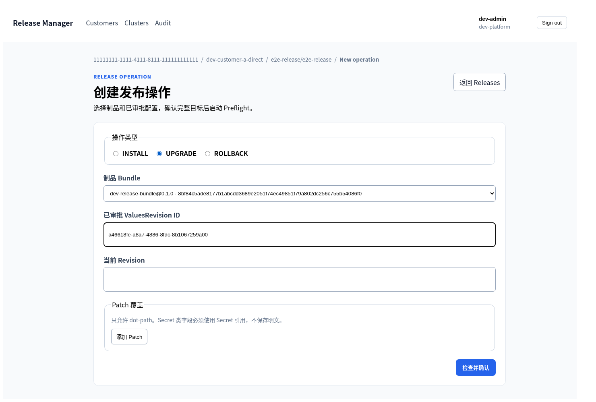

### 9.2 确认

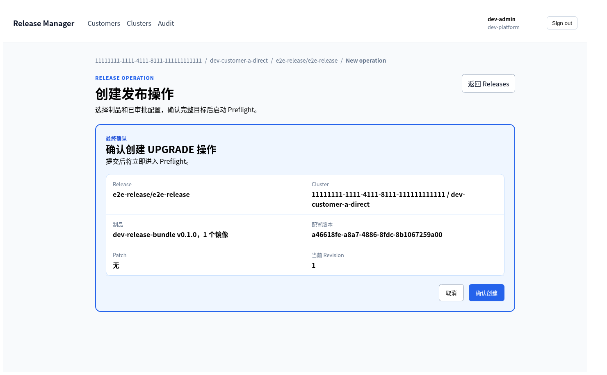

确认面板复述完整目标：`Release` / `Cluster` / `制品` / `配置版本` / `Patch` / `当前 Revision`，
并明确告知 `提交后将立即进入 Preflight`。点 `确认创建` 后创建并进入详情页。

> ⚠️ **当前交付版本下这一步会失败**：点 `确认创建` 得到
> `操作创建失败 invalid token: parse access token: token has invalid claims: token is expired`，
> 而用户的会话其实是好的 —— 这是服务端授权快照拉取失败的**透传消息**（`docs/ux-review.md` 的 B4）。
> 下面 9.3 的详情截图来自**已修复该链路**的临时环境，且其中的 Operation 由项目自带的
> `test/e2e/prerequisite/smoke.sh` 真实创建（`44 pass / 0 fail`）。

### 9.3 详情与 Preflight

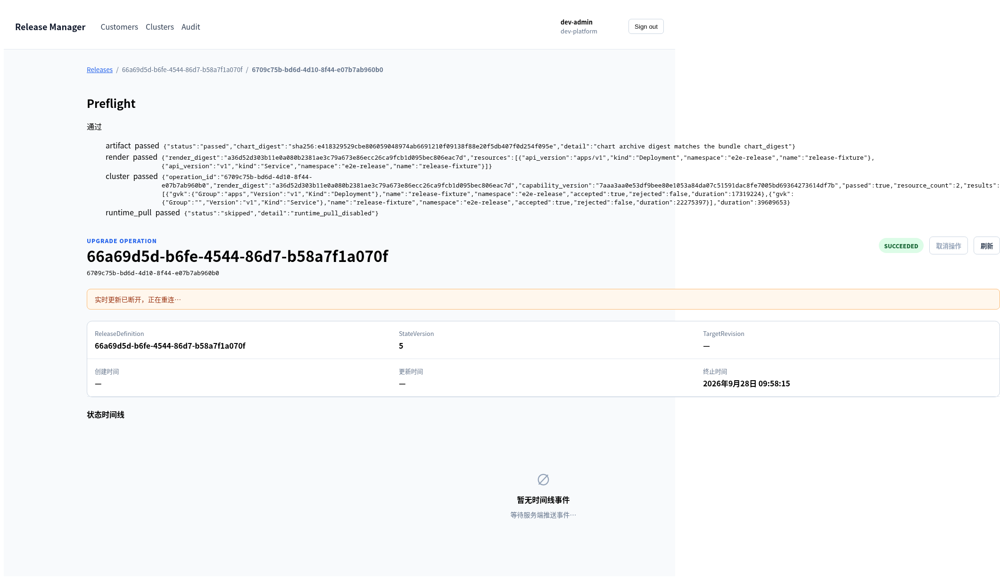

详情页自上而下是：**Preflight 面板**（本次为 `通过`，逐 stage 显示 `artifact` / `render` 及 detail）、
状态徽章、`取消操作` / `刷新`、目标与状态元数据（`ReleaseDefinition` / `StateVersion` /
`TargetRevision` / 创建·更新·终止时间）、`状态时间线`。

> 注意截图里的 Preflight detail 是**原始 JSON 原文**，长值不换行会把整页撑出横向滚动
> （该整页截图宽 2121px > 视口 1440px），右侧内容在默认窗口下看不到；见 `docs/ux-review.md` 的 B6。

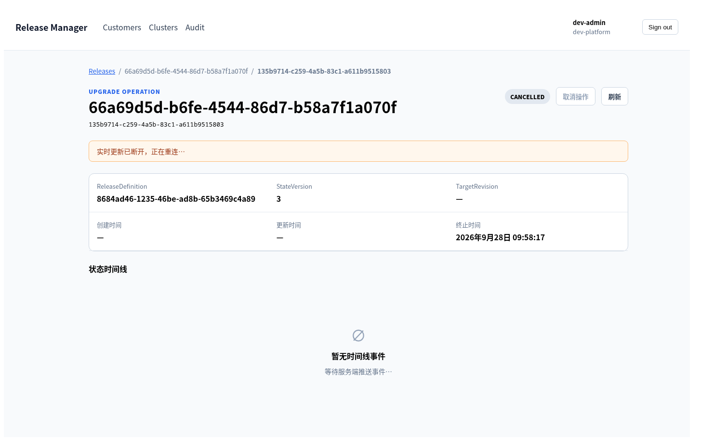

已取消的操作同样可回看；被取消、失败的操作不会再产生新的时间线事件。

> 上图里的 `实时更新已断开，正在重连…` 不是偶发网络问题：服务端流式拦截器要求
> `Authorization` 头而**不接受 cookie 会话**，所以浏览器会话下时间线实时更新必然失败
> （`internal/auth/interceptor.go:172`）。详见 `docs/ux-review.md` 的 B3。

## 10. 紧急变更与收敛

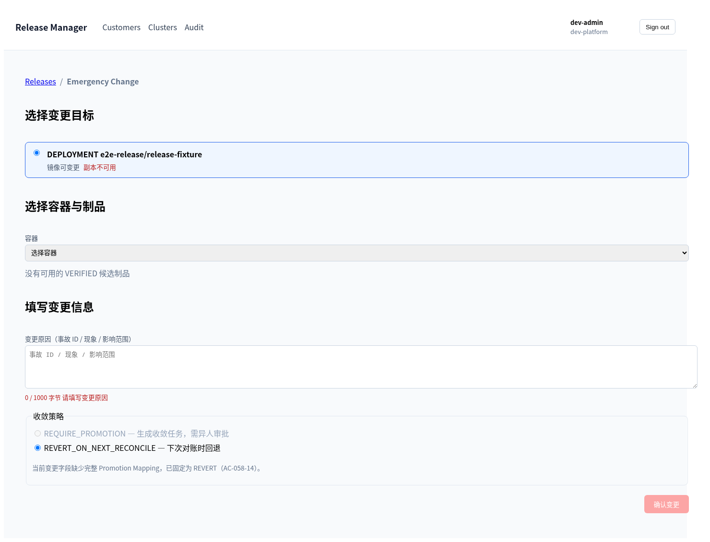

紧急变更用于「常规流程来不及」的场景，页面按四步编排：选择变更目标（工作负载）→ 选择容器与制品 →
填写变更信息（`变更原因`，0/1000 字节计数）→ 确认变更（收敛策略 `REQUIRE_PROMOTION` 或
`REVERT_ON_NEXT_RECONCILE`，并勾选风险确认）。

页面顶部的三个状态指示决定你能做多少：`镜像可变更` / `副本不可用` —— 当平台尚未采集到该工作负载的
容器信息时，会显示 `镜像变更暂不可用：平台尚未采集到该工作负载的容器信息…` 并禁用相应控件；
没有 `VERIFIED` 候选制品时显示 `没有可用的 VERIFIED 候选制品`。

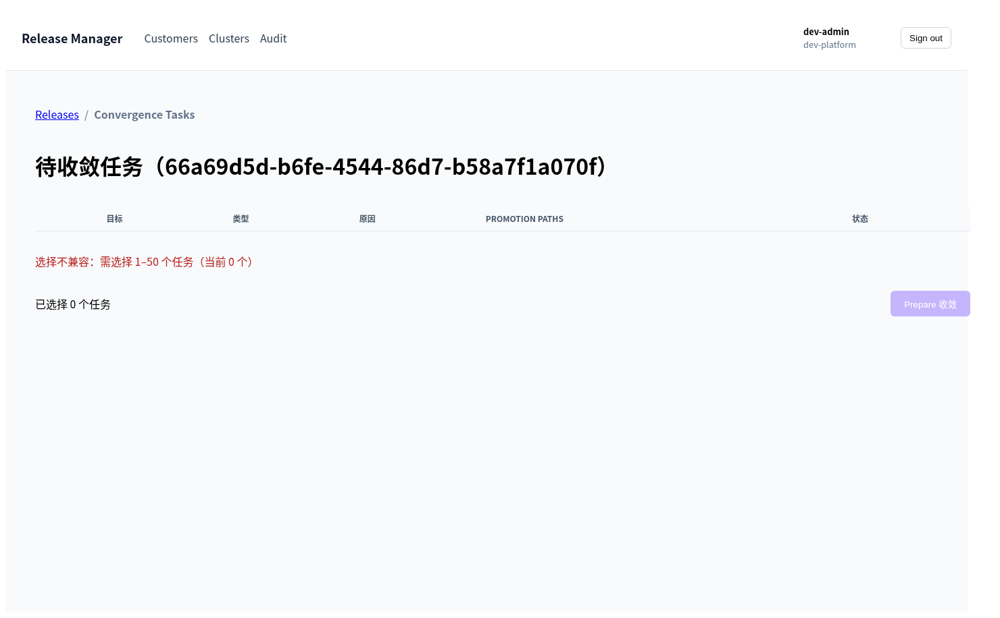

收敛页把紧急变更欠下的账列成任务（`目标` / `类型` / `原因` / `PROMOTION PATHS` / `状态`），
勾选 1–50 个任务后 `Prepare 收敛`；选择数为 0 时按钮禁用并提示
`选择不兼容：需选择 1–50 个任务（当前 0 个）`。

## 11. 审计

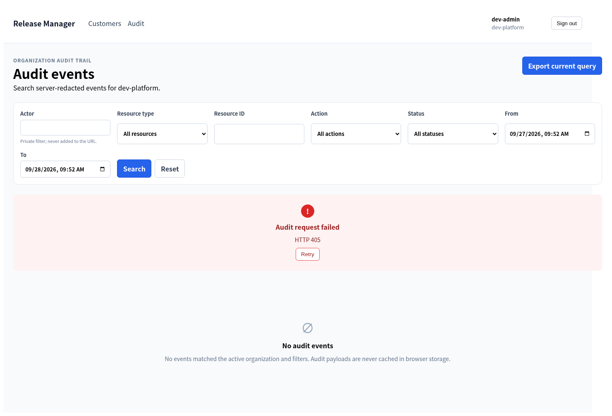

审计页可按 `Actor` / `Resource type` / `Resource ID` / `Action` / `Status` / `From` / `To` 过滤，
`Export current query` 生成导出任务。**注意 `Actor` 是私有过滤条件，不会写进 URL。**

> ⚠️ 上图是**修复前**的失败态（保留以说明当时的现象）：审计 RPC 返回 `HTTP 405`，页面同时渲染了
> `Audit request failed HTTP 405` 与 `No audit events`（把错误解释成空结果）。原因是当时控制台入口
> 没有把 `/audit.v1.AuditService` 路由到 `release-api`。**现状（TASK-174 之后）**：容器侧
> `web/nginx.conf:91` 已有 `location ^~ /audit.v1.` → `api:8088`，dev 侧 `web/vite.config.ts:62-63`
> 指向 8088（`:62` 是 key、`:63` 是 target）⇒ 该 405 已修复。
> 详见 `docs/ux-review.md` 的 B5。

## 12. 权限与角色

前端只做 UI 门禁，**服务端 Casbin 才是唯一裁决点**：

| 门禁 | 派生量 | 谁可以通过 |
| --- | --- | --- |
| 写操作入口（`Create customer` / `Edit` / `Save`） | `canWrite`（非 `viewer` 即可写） | platform_admin、release_admin、deployer |
| Operator 注册/撤销 | `canEnrollOperators` / `canRevokeOperators` | platform_admin、release_admin |
| 创建发布操作 | `canCreateReleaseOperation` | platform_admin、release_admin |
| 紧急变更执行 | 服务端 Authorization Snapshot 的 `canExecuteEmergency` | 由服务端裁决 |
| 收敛任务 Prepare | 服务端 `canCreateValuesRevision` | 由服务端裁决 |

无权限时的表现分三层：入口隐藏（`v-if`）、路由 404（特性开关关闭）、页面 403
（`ForbiddenState`，例如 `/forbidden`）。

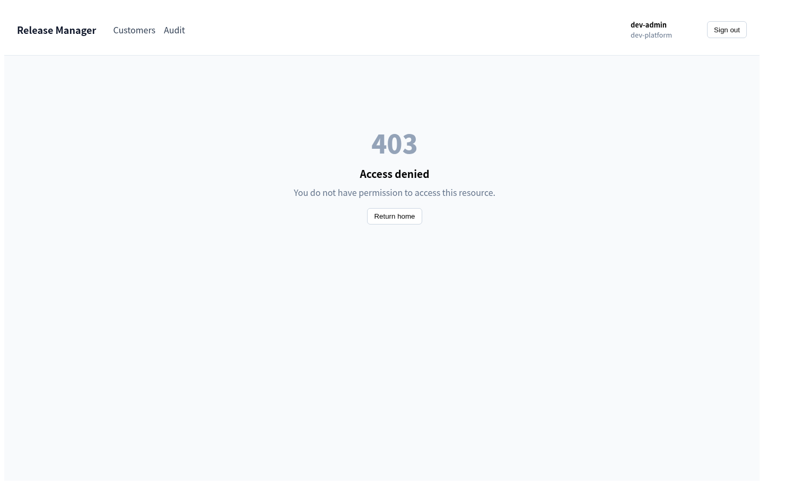

## 13. 特性开关

`web/.env.example` 是完整清单。所有开关的判定语义都是 `!== 'false'`：**默认全开，只有精确字符串
`false` 才关闭**（写 `FALSE` / `0` 无效）。

| 变量 | 关掉后 |
| --- | --- |
| `VITE_ENABLE_RELEASE_INVENTORY` | Release 清单与 Values、操作、紧急变更路由整组消失 |
| `VITE_ENABLE_VALUES_REVISION` | Values 编辑器路由与表格入口消失 |
| `VITE_ENABLE_RELEASE_OPERATIONS` | 操作创建/详情、紧急变更、收敛路由消失 |
| `VITE_FEATURE_CLUSTER_ROUTING` | 集群路由与导航入口消失 |
| `VITE_FEATURE_OPERATOR_MANAGEMENT` | Operator 入口消失 |
| `VITE_OPERATION_LIVE_UPDATES` | 操作详情不做实时刷新（只保留 `刷新`） |

## 14. 常见问题

| 症状 | 先查什么 | 说明 |
| --- | --- | --- |
| 页面全白、无任何报错 | 后端是否可达（`curl http://localhost:8085/readyz`） | 引导阶段 `GetInitStatus` 抛错会让应用**根本挂载不上**（`web/src/main.ts:12`），表现是白屏而非错误页；留档 `docs/images/user-manual/22-blank-page-backend-down.png` |
| 登录成功却停在 `/login` | 登录响应是否带 `Set-Cookie`、`user` 是否非空 | 后端若跑在 token 模式，前端（只实现 cookie 模式）永远进不去；见 B1 |
| 操作详情一直显示 `实时更新已断开，正在重连…` | 服务端 `WatchOperation` 是否 `unauthenticated` | 流式拦截器不接受 cookie 会话；见 B3 |
| 点 `确认创建` 报 `invalid token … token is expired` | 会话本身是否过期（通常没有） | 这是 orchestrator 后台快照拉取失败的**透传消息**，不是你的会话问题；见 B4 |
| 审计页 405 | 审计 RPC 是否被代理到 `release-api` | 见第 11 节；B5 |
| Operator 显示 `Offline` / 心跳陈旧 | 客户集群里 operator Pod 是否存活 | 控制台只呈现状态，处置见 `docs/runbook.md` |

## 15. 本次环境与补丁记录（可复现）

```bash
# 1) 环境（避开同机另一套环境占用的默认端口）
REGISTRY_PORT=5011 DEV_K3D_API_PORT=6449 make dev-up
make dev-status                       # 期望：5 集群 ready、fixture v2、2 customer / 4 cluster

# 2) 补丁（独立 worktree，主工作树不动）
git worktree add .worktrees/ux-manual -b ux/manual-auth-dualmode
#    改动：cmd/auth/main.go（传入 BrowserSessionConfig）、
#          internal/auth/{browser_session.go,service.go}（dual-mode：同时返回 token 与 cookie）
go test ./internal/auth/...           # ok，17s

# 3) 只重建、只替换 release-auth
docker build -f .worktrees/ux-manual/deploy/docker/Dockerfile.auth \
  -t localhost:5011/release-auth:ux-manual .worktrees/ux-manual
docker push localhost:5011/release-auth:ux-manual
KUBECONFIG=data/kubeconfig.yaml kubectl --context k3d-release-manager-control \
  -n release-manager-dev set image deployment/auth auth=localhost:5011/release-auth:ux-manual

# 4) 回归证据（token 链未被破坏）
bash test/e2e/prerequisite/smoke.sh   # 44 pass / 0 fail，含 auth 跨重启 ValidateToken/RefreshToken
```

> 事实源：`deploy/dev/dev.sh`、`Makefile`（dev-* 目标）、`docs/dev-environment.md`、
> `web/src/router/index.ts`、`web/src/pages/`、`web/src/components/`、`web/.env.example`、
> `internal/auth/interceptor.go`、`internal/authorization/module.go`、`internal/devfixture/`。
